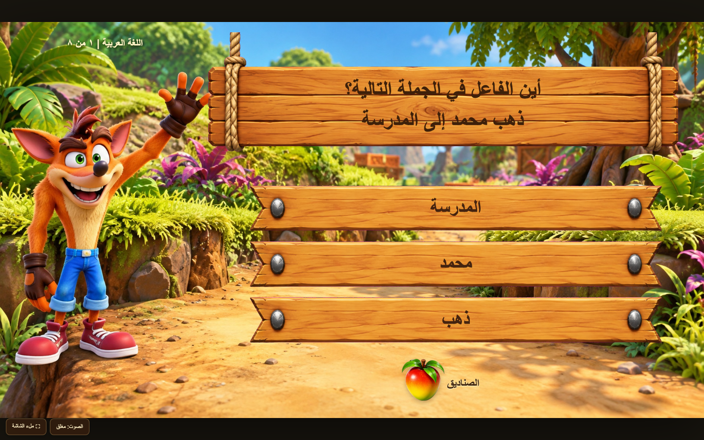

# Crash Game Kit: PowerPoint + HTML + reusable Claude Code skill

A complete worked example of rebuilding a game-like classroom presentation from video references, then making a faithful offline HTML edition.



## Open the finished examples

**[Download the complete kit](https://github.com/RoXsaita/crash-game-kit/releases/latest/download/Crash-Game-Kit.zip)** · **[PowerPoint](https://github.com/RoXsaita/crash-game-kit/releases/latest/download/Crash-Classroom.pptx)** · **[Offline HTML](https://github.com/RoXsaita/crash-game-kit/releases/latest/download/Crash-Classroom.html)**

[](https://github.com/RoXsaita/crash-game-kit/actions/workflows/build.yml)

- **PowerPoint:** `deliverables/Crash-Classroom.pptx`. Open in desktop PowerPoint and use **Slide Show → From Beginning**.
- **HTML:** `deliverables/Crash-Classroom.html`. Open in a modern desktop browser. Media is embedded; no server or internet is required to play.

The ready-to-use files are distributed as **GitHub Release assets**, rather than duplicated in Git history. A source checkout contains everything needed to rebuild them using the commands below. Download the release ZIP for both finished files plus source and skill; download the individual HTML or PPTX if you only want to play.

The examples contain eight Arabic questions, six multiple-choice and two true/false. The PPTX has 36 slides because feedback uses linked answer states. Its text and click targets are native editable PowerPoint objects. The HTML additionally tracks completed crates, saves progress locally, and provides a question editor with portable export.

## Use with Claude Code

1. Clone this repository or extract a release ZIP, including the hidden `.claude` directory.
2. Start Claude Code **in that folder**.
3. Invoke:

```text
/reference-game-builder
```

Then describe the theme, reference video and desired output format. The skill is installed as a project skill at `.claude/skills/reference-game-builder/SKILL.md`; `CLAUDE.md` also points Claude to the implementation.

A ready-to-paste task is in `START-HERE-CLAUDE.md`. To use the skill in another project, copy the entire `reference-game-builder` folder into that project's `.claude/skills/`. To make it personal, use the documented `~/.claude/skills/` location. The source/example files are optional for the general skill, but required to rebuild this exact example.

## How this was actually made

1. Inspect both reference videos frame by frame; identify the intro, portal, crate selection, wooden boards, mascot placement and answer feedback.
2. Generate backgrounds and props **without question text**. Make separate character and UI assets. The four generation prompts and actual raw outputs are included.
3. Crop the prop sheet and remove its magenta background. Draw feedback icons and synthesise short WAV sounds.
4. Render real 3D crates and a portal in Three.js. The character in the intro is a 2D generated cutout/billboard, not a rigged 3D model. Capture deterministic frames and encode embedded MP4s.
5. Build the native `.pptx` with python-pptx: separate images, editable Arabic text, internal slide links, feedback states, PresentationML entrance animations and embedded media.
6. Reuse the same assets/question bank in a plain HTML/CSS/JavaScript game, then embed every asset as a data URL for a single-file delivery.
7. Check Office package structure/links, render all slides, inspect actual browser screens, exercise the game, fix problems and retest.

The skill contains the detailed workflow, image prompts, PowerPoint internals, HTML architecture and verification/sharing rules. This is not just a high-level prompt.

## Rebuild without generating new images

Requirements: **Python 3.11+ and Node.js on PATH**. Python dependencies are pinned. ffmpeg is only needed to rerender videos or create the optional preview; LibreOffice/PowerPoint is only needed for optional office rendering. An image-generation account is not needed to rebuild using included assets.

macOS/Linux:

```bash
python3 -m venv .venv
source .venv/bin/activate
python -m pip install -r requirements.txt
python -m playwright install chromium
python scripts/build_all.py
python scripts/check_all.py
```

Windows PowerShell, without changing execution policy:

```powershell
py -3 -m venv .venv
.\.venv\Scripts\python.exe -m pip install -r requirements.txt
.\.venv\Scripts\python.exe -m playwright install chromium
.\.venv\Scripts\python.exe scripts/build_all.py
.\.venv\Scripts\python.exe scripts/check_all.py
```

`build_all.py` writes both finished files to `deliverables/`. Change questions in **one place**: `source/crash-powerpoint/questions.json`. `correct` is a zero-based option index. The provided layout expects exactly eight questions and two or three choices per question. Question-specific test fixtures must be updated honestly if you change the sample bank.

## Folder map

```text
.claude/skills/reference-game-builder/   Reusable skill + five detailed references
CLAUDE.md                              Agent entry instructions
START-HERE-CLAUDE.md                    Ready-to-paste task
source/crash-powerpoint/                Native generator, question JSON, assets, raw images, WebGL renderer
source/crash-html/                      HTML template, builder and browser tests
scripts/                               Build, check and privacy/integrity audit
previews/                              Actual rendered screenshots
deliverables/                          Generated PPTX and HTML (Git-ignored)
.github/workflows/                     Build, offline browser tests, and tag releases
dist/                                  Generated release ZIP/checksums (Git-ignored)
```

## Development and releases

- See [CONTRIBUTING.md](CONTRIBUTING.md) for development checks and release steps.
- Pushes and pull requests build both formats and run the package and offline browser tests.
- Tags matching `v*` run the same checks before creating a GitHub Release with the HTML, PPTX, complete kit ZIP and SHA-256 checksums.
- Original authoring code and documentation are MIT-licensed. The franchise-style example art is **not** covered by a commercial franchise licence; see [sources and rights](docs/SOURCES-AND-RIGHTS.md).

## Important boundaries

- The PPTX does not persist scores or used-crate state. The HTML does save progress. Neither is a secure exam or networked multiplayer system.
- Office-engine rendering/link checks were performed. **Live Microsoft PowerPoint playback was not verified.** Physical iOS/Android and native mobile PowerPoint were not tested.
- Local HTML previews on phones may not execute JavaScript. Use a desktop browser, or separately host the HTML if desired.
- The example recreates a visual style; it is not the original sellers' file. Third-party characters/brands retain their owners' rights. This bundle does not grant a commercial franchise licence. Use original or properly licensed characters for resale.
- No API keys, account tokens, browser profiles, chat transcripts, private machine paths or proprietary fonts are included. See `docs/EXPORT-SCOPE.md`.
